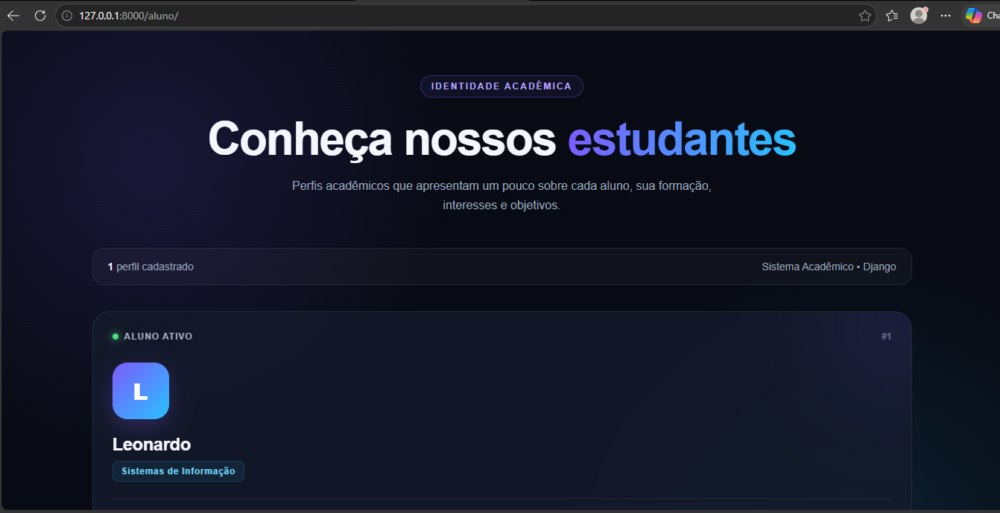
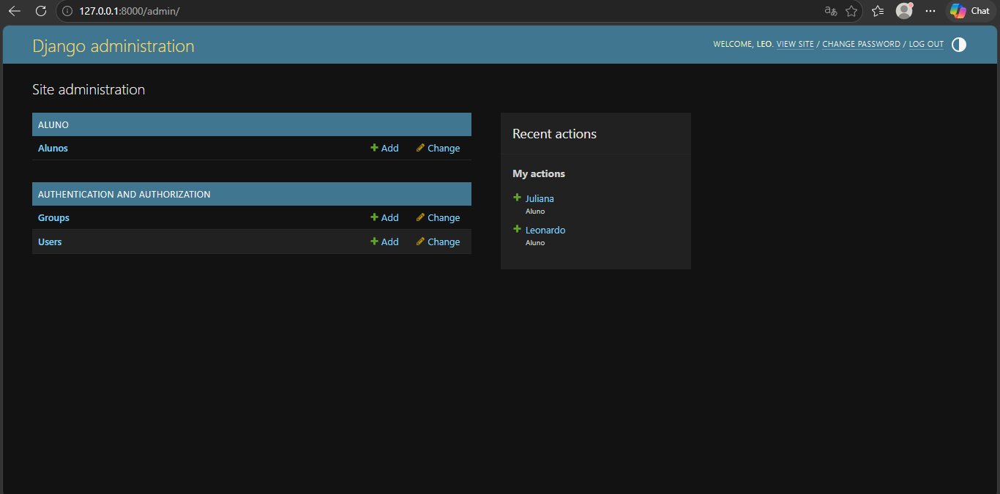

Cartão de Identidade Acadêmica

Projeto desenvolvido para a disciplina de Programação Backend, utilizando Python e Django.

A proposta do sistema é representar alunos por meio de um cartão de identidade acadêmica digital, apresentando informações como nome, curso e bio.

Funcionalidades
Cadastro de alunos pelo painel administrativo do Django
Armazenamento dos dados em banco SQLite
Listagem dos alunos cadastrados
Exibição de Nome, Curso e Bio
Interface responsiva em formato de cartões acadêmicos
Identificação visual de cada aluno por meio da inicial do nome
Tecnologias utilizadas
Python
Django 5.2.17
SQLite
HTML
CSS
Git e GitHub
Estrutura principal
projeto_aluno/
│
├── aluno/
│   ├── migrations/
│   ├── templates/
│   │   └── aluno.html
│   ├── admin.py
│   ├── apps.py
│   ├── models.py
│   ├── urls.py
│   └── views.py
│
├── core/
│   ├── settings.py
│   ├── urls.py
│   ├── asgi.py
│   └── wsgi.py
│
├── db.sqlite3
├── manage.py
├── requirements.txt
└── README.md
Modelo Aluno

O sistema utiliza o model Aluno, contendo os seguintes campos:

nome — nome do aluno
curso — curso em que o aluno está matriculado
bio — breve descrição do aluno, seus interesses ou objetivos
Instalação

Clone o repositório:

git clone https://github.com/LeonardoMarcondesSI/Projeto-Django.git

Entre na pasta do projeto:

cd Projeto-Django

Crie um ambiente virtual:

python -m venv venv
Ativação no Windows
venv\Scripts\activate

Instale as dependências:

pip install -r requirements.txt

Execute as migrações:

python manage.py migrate
Executando o projeto

Com o ambiente virtual ativo, execute:

python manage.py runserver

O servidor será iniciado normalmente em:

http://127.0.0.1:8000/
Endpoints
Lista de alunos
/aluno/

Exibe os cartões acadêmicos dos alunos cadastrados.

Exemplo:

http://127.0.0.1:8000/aluno/
Painel administrativo
/admin/

Permite administrar e cadastrar alunos por meio da interface administrativa do Django.

Exemplo:

http://127.0.0.1:8000/admin/
Criando um administrador

Caso seja necessário criar um novo usuário para acessar o painel administrativo:

python manage.py createsuperuser

Depois, acesse /admin/ e utilize as credenciais cadastradas.

Funcionamento

O projeto utiliza a arquitetura MVT do Django:

URL
 ↓
View
 ↓
Model / Banco de Dados
 ↓
View
 ↓
Template
 ↓
Navegador

Ao acessar /aluno/, a rota direciona a requisição para a View responsável. A View consulta os registros do model Aluno e envia os dados para o template, que exibe os cartões acadêmicos.

Demonstração
Página de cartões acadêmicos

Painel administrativo

Autor

Leonardo Henrique Rodrigues Marcondes

Projeto desenvolvido para a disciplina de Programação Backend.